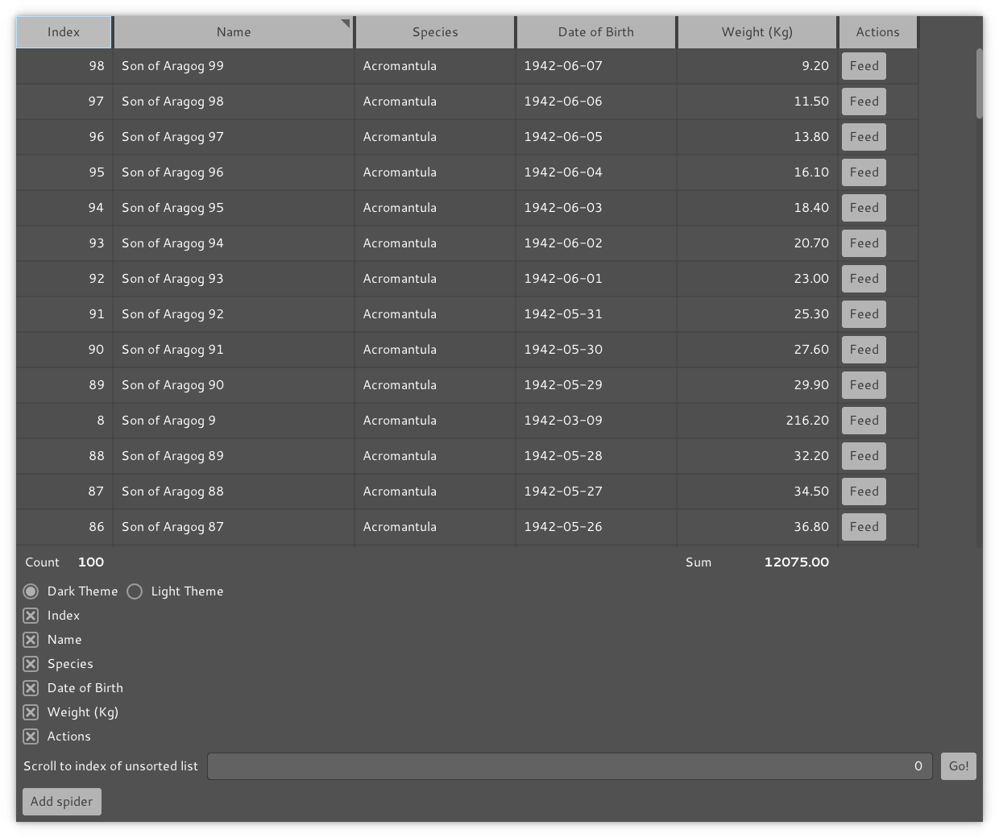

# Monomer-Hagrid

A datagrid widget for the [Monomer](https://github.com/fjvallarino/monomer) library.



## Current Status
- Somewhat buggy and incomplete. Don't build your business on this.

## Current Features
- Vertical and horizontal scrolling.
- Resizable columns.
- Column sorting, with a customizable sort key.
- Configurable column alignment (left or right).
- Custom widgets for each cell, to override the standard label.
- Custom width/height padding for each cell, configured per column.
- Scrolling to a particular row when sent a message.
- Custom footer widgets on the bottom of each column.
- Efficient implementation that only inflates visible widgets, scaling to at least 10000 rows.

## Definite Future Goals
- Better documention.
- Better tests.
- Prettier appearance.

## Possible Future Goals
- Explore providing an API where current sort/column widths/etc are stored in the parent model and updated by hagrid via a lens. This may remove some complexity around merging and the specification of initial sorts/column widths.

## API Documentation

See the generated docs on [Hackage](https://hackage.haskell.org/package/monomer-hagrid).

## To build and run examples
```bash
stack build --flag monomer-hagrid:examples
`stack path --local-install-root`/bin/example-basic          # Demo of the basic functionality.
`stack path --local-install-root`/bin/example-big-grid       # Demo of a grid with over 10000 rows.
`stack path --local-install-root`/bin/example-resizing-cells # Demo where the cells are constantly changing size.
```

## Contribution Guide
- This is "free as in mattress" software!
- You are welcome to open an issue with bug reports or feature requests, but you may not get a response.
- Unsolicited pull requests will likely be ignored.

### To format the source code

```bash
# Should use Ormolu 0.7.1.0
ormolu --mode inplace $(find . -name '*.hs')
```